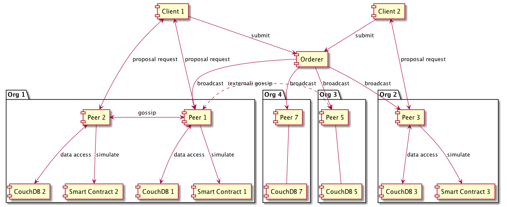

# Hyperledger Fabric Formal Model (as of v1.4)

## Modules

### Old (or Pending)

- [Fabric.tla](Fabric.tla): Main class. Includes the followings:
  - [Peer.tla](Peer.tla): Peer node
  - [Orderer.tla](Orderer.tla): Orderer node
  - [Client.tla](Client.tla): Client node

## Specs

- Fabric: The whole system of Fabric
- Client: Model checking experiment of [Client.tla](Client.tla) module, which itself is a part of Fabric.

# Architecture

Typical Deployment of Components:



# 検証のポイント

Fabricがパフォーマンスや多機能化のために、通常の分散合意から拡張している部分の正当性を検証

- MVCC (Multi-Version Concurrency Control): TXの simulation と commit を分離
- Private Data Collection: メインチェーンにはキー・バリュー値のハッシュのみを格納する。プライベートデータ自身は gossip プロトコルによりピア間で共有
- [未定] データストアとして CouchDB を使った場合の phantom read などのモデル化?
- [未定] ゼロ知識証明

## Correctness (Safety, Agreement, Validity, Finality)

まず RWSet の性質から。状態 s1, s2 で `f(s1)=s2` で simulation 時の RWSet が `(r,w)` のとき、

```
(*
以降の証明には Simulation = RWSet の決定、の特徴づけが必要。おそらく以下のような感じで大丈夫。TLA+ の記法に引き写す

なお、RWSet = ReadSet \X WriteSet = [Key -> Version] \X [Key -> Value]

(1: Read Set) 【間違ってる】 s1 と s2 が Read Set のドメインで一致するならば、f(s1) = f(s2)
(2: Write せt) s1 と f(s1) は、Write Set のドメインを除いては同一
*)
```

- Agreement
  - すべての正常なピアについて、ある slot にコミットされている tx は同一である。この帰結として、
  - 過半数 (ビザンチン耐性をもたせる場合は 3/2) のピアがなんらかの tx をコミットしている状態を「選択されている」状態としたときに、ある slot で tx1 および tx2 がコミットされているならば、 tx1=tx2 である
- これと MVCC 検証の帰結として、
  - コミットされているトランザクション列 tx_0,...,tx_n とその時点での world state s_n に関して、初期状態のから順に tx_i を適用して world_state を実際に計算していったときに、その結果が s_n と一致する  

- 以下 *to be written*

## Liveness

*to be written*

# Tips

- `Print` または `PrintT` を使うには `TLC` モジュールが必要
- モデル検査の設定や検査器による出力は `<Spec名>.toolbox/<モデル名>/` に格納される。以下、これをカレントディレクトリとする
  - モデル検査時にのみモジュールを追加したい場合には、他の定義と同様に `Additional Definitions` に足せばいいがコツがある:
    - ひとつめの方法は `, <モジュール名>` とする方法。これは定義の文がそのままオリジナルの spec ファイルに追加されるため。オリジナルの先頭が `EXTENDS <モジュール>, ...` である場合にはこれで上手くいく。
    - そうでない場合は `INSTANCE <モジュール名>` とするとよい。
    - ※なお、`EXTENDS <モジュール名>` は大抵の場合上手くいかない。ひとつのモジュール中に `EXTENDS` は1箇所しかあってはいけないからである。
  - 上記で追加された定義は `MC.tla` に追加される
  - モデル検査の設定は最終的には `MC.cfg` に書かれる。ここには上記 `MC.tla` の定義への参照が書かれる
  - モデル検査器 (TLC) の出力は `MC{_TE}.out` に記録されるが、両者の違いはわかってない


# Open questions by me

- 配列的に instantiate することは可能なのか? `1..N -> Peer(i)` みたいな感じで `Peer(i)` をインスタンス化したい。たぶん `[i \in 1..N |-> INSTANCE ...]` のようにできるとは思うが、もっとスマートに書きたい。

---
Contact: Shin Saito <shinsa@jp.ibm.com>, Blockchain Technology, IBM Research - Tokyo
